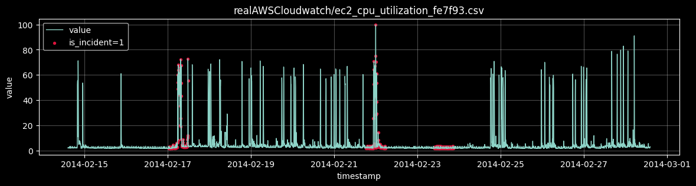
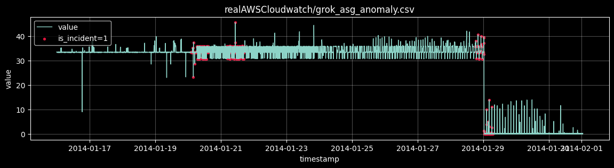
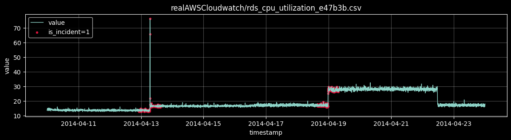
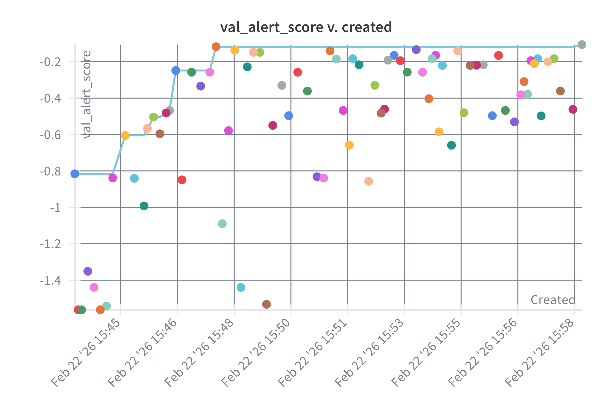
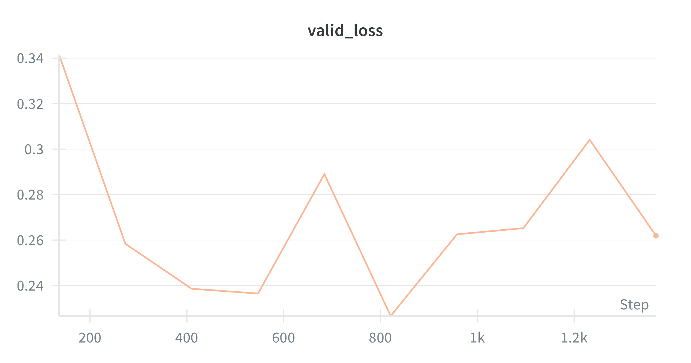

# Predictive Alerting for Cloud Metrics


## Table of Contents
- [Description](#description)
  - [Example Time Series with Incident Intervals](#example-time-series-with-incident-intervals)
- [Installation](#installation)
- [Development Workflow](#development-workflow)
- [Usage](#usage)
  - [RandomForest Baseline](#randomforest-baseline)
  - [InceptionTimePlus (Sequence Model)](#inceptiontimeplus-sequence-model)
- [Design Choices and Thought Process](#design-choices-and-thought-process)
  - [1. Initial Formulation and Failure Mode](#1-initial-formulation-and-failure-mode)
  - [2. Corrected Target: Incident Starts Only](#2-corrected-target-incident-starts-only)
  - [3. Sequence Modeling Attempt](#3-sequence-modeling-attempt)
  - [4. Main Insight](#4-main-insight)
  - [5. Limitations](#5-limitations)
  - [6. Future Directions](#6-future-directions)
- [Final Reflection](#final-reflection)

## Description

This repository contains an end-to-end prototype of a predictive alerting system for cloud service metrics. 
The objective is to estimate whether an incident **start** will occur within the next `H` time steps, based on the previous `W` observations of a metric time series.

The experiments are conducted on the [NAB](https://github.com/numenta/NAB) AWS CloudWatch subset. Each time series is processed independently. 
Windows are generated using a sliding-window formulation, and the model outputs a probability score that is converted into alerts using a validation-derived threshold.

Two modeling paths are implemented:

1. **Tabular baseline (RandomForest / XGBoost)**
   Windows are summarized into statistical features (trend, volatility, quantiles, recent state) and passed to tree-based classifiers.

2. **Sequence model (InceptionTimePlus)**
   Raw ordered windows are used directly as time-series input, allowing the network to learn temporal patterns without manual feature engineering.

The system is evaluated at the **incident level**, not only point-wise. The primary metrics are:

* Incident recall (fraction of incidents caught with at least one early alert),
* Median lead time,
* False alerts per day.

This framing reflects operational reality: catching incidents early is useful only if alert volume remains manageable.

W&B project:
[Predictive-alerting-for-cloud-metrics](https://wandb.ai/tombik-warsaw-university-of-technology/Predictive-alerting-for-cloud-metrics)

### Example Time Series with Incident Intervals
The figure below shows a representative example from the test set. The blue curve represents the metric value over time, while shaded regions correspond to incident intervals.

<p>
  
</p>
<p>
  
</p>
<p>
  
</p>

Looking at the plot, a few things stand out immediately. Most of the time the system stays in long, relatively calm periods with small fluctuations. 
When incidents happen, the transition is often sudden rather than gradual. 
In many cases, there is no clear upward or downward trend that would signal that something is about to break. 
The series also shows occasional spikes that are not followed by incidents, which makes simple threshold-based reasoning unreliable.

The example comes from the test set and is shown for illustration purposes only. 
It demonstrates the structural difficulty of extracting predictive signal from single-metric data.

## Installation

This project uses `uv` for dependency management.

After cloning the repository:

```bash
uv sync
```

Experiments log to Weights & Biases. Make sure your API key is available:

```bash
export WANDB_API_KEY="YOUR_WANDB_API_KEY"
```

Alternatively, store it in a `.env` file:

```env
WANDB_API_KEY=YOUR_WANDB_API_KEY
```

## Development Workflow

Code quality is enforced using Ruff, which provides both linting and formatting.

To check the codebase:

```bash
uv run ruff check .
```

To format the project:

```bash
uv run ruff format .
```

## Usage

Start by running tests:

```bash
uv run pytest
```

### RandomForest Baseline

Hyperparameter optimization was performed using Bayesian search to improve sample efficiency compared to grid search. Instead of optimizing average precision, I defined an alert-oriented validation objective:

```
val_alert_score = incident_recall - 0.01 * false_alerts_per_day
```

This prioritizes recall while softly penalizing excessive alert volume.

Run the sweep:

```bash
uv run python experiments/baseline/sweep_baseline.py --count 80
```

Train the final model:

```bash
uv run python experiments/baseline/train_baseline.py
```

<p>
  
</p>

The sweep explores tree depth, number of estimators, and regularization parameters. Threshold selection is performed after training, based on validation performance.


### InceptionTimePlus (Sequence Model)

For the sequence branch, I trained InceptionTimePlus directly on raw sliding windows.

```bash
uv run python experiments/inception/train_inception.py
```

<p>
  
</p>

Due to extreme class imbalance and weak early signal observed during sanity checks, I did not run a full hyperparameter sweep for the deep-learning branch. 
Preliminary notebook experiments indicated that validation behavior was close to random ranking, so I prioritized further investigation of labeling strategy and threshold behavior.

Saved artifacts are written to `artifacts/`.


## Design Choices and Thought Process

### 1. Initial Formulation and Failure Mode

My first label definition marked a window positive if **any incident timestamp appeared in the future horizon**.

This seemed reasonable at first, but it introduced a subtle issue: many positive samples came from windows where the system was already inside an incident. 
As a result, the task effectively became *“detect that I am already failing”* rather than *“predict that I will fail soon.”*

The issue became clear when I compared training and validation performance:

* Train AP ≈ 0.95
* Validation AP ≈ 0.15–0.16
* Large generalization gap across RandomForest and XGBoost

Reducing model capacity, shortening the horizon, and engineering additional features did not meaningfully change validation performance. The signal simply did not transfer across series.

This strongly suggested that either:

* early-warning signal is extremely weak, or
* the problem formulation was incorrect.

### 2. Corrected Target: Incident Starts Only

To align the task with real alerting objectives, I redefined the label:

* `is_start[t] = 1` if `is_incident[t] == 1` and `is_incident[t-1] == 0`
* History windows overlapping incidents were removed.
* A sample is positive only if an **incident start** occurs within the prediction horizon.

This forces the model to learn strictly pre-incident behavior.

After this correction, I switched from average precision to **event-level evaluation**, focusing on:

* Incident recall
* Median lead time
* False alerts per day

This better reflects operational constraints.

Best RandomForest test results:

* Incident recall: **0.375 (3/8 incidents)**
* Median lead time: **55 minutes**
* False alerts per day: **27.38**
* Threshold: **0.02**

While recall is modest, alerts are meaningfully early.

### 3. Sequence Modeling Attempt

To verify that no temporal pattern was hidden from tabular features, I trained InceptionTimePlus on raw ordered windows.

Dataset characteristics:

* Window of length 144 timestamps, horizon 12 timestamps
* Extremely imbalanced (positive ratio ≈ 0.5% on a validation split)
* Long stable regimes

Observed results:

* Average precision ≈ random
* High recall possible only with extreme threshold lowering
* False alerts per day exceeding 170+

This confirmed that the core limitation is not simply feature engineering. Under current formulation, the early-warning signal appears weak and highly series-specific.

### 4. Main Insight

The most important observation from this project is that model complexity does not compensate for weak predictive signal.

Tree ensembles and deep sequence models behaved similarly. When recall increased, alert spam exploded. When false alerts were controlled, recall dropped.

The real challenge lies mostly in signal quality, label definition and evaluation design

### 5. Limitations

* Single-metric modeling per series
* No cross-metric correlation modeling
* Extreme class imbalance
* Limited time for deep-learning hyperparameter exploration

### 6. Future Directions

The most promising next steps are:

1. Incorporate multi-metric context per service.
2. Explore service-specific threshold calibration.
3. Revisit sequence modeling after stabilizing extremely low positive class ratio.


## Final Reflection

This project did not evolve the way I initially expected. I started with a straightforward classification setup and assumed that, with enough tuning, the model would learn a useful early-warning signal. That did not happen.

Instead, most of the progress came from realizing that the problem formulation itself was flawed. The first label definition unintentionally rewarded detecting ongoing incidents rather than predicting upcoming ones. After correcting that, the results became more realistic.

The final prototype does not achieve high recall at low alert volume, but it clearly shows where the bottlenecks are. More importantly, it provides a clean experimental framework that makes those limitations visible and measurable.
